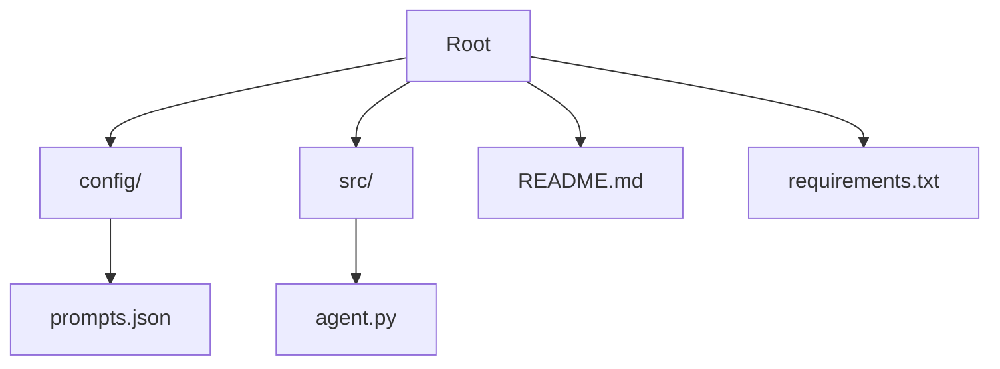

# 🏥 DoctisAImo (v3.0-KAGGLE-MAPS)

> **Advanced AI Triage Assistant | Assistant de Triage IA Avancé**
> *Powered by Generative AI & Medical Data Logic*

---

## 🌍 Overview | Vue d'ensemble

### 🇬🇧 English

**DoctisAImo** is a state-of-the-art AI assistant designed for emergency medical triage. Unlike standard chatbots, DoctisAImo v3.0 leverages **Data-Driven Logic** inspired by Kaggle medical datasets to interpret symptoms with statistical rigor. It provides safety assessments, second opinions, and emergency action plans in **any European language**.

### 🇫🇷 Français

**DoctisAImo** est un assistant IA de pointe conçu pour le triage médical d'urgence. Contrairement aux chatbots standards, la version 3.0 de DoctisAImo utilise une **logique orientée données** (inspirée des datasets médicaux Kaggle) pour interpréter les symptômes avec une rigueur statistique. Il fournit des évaluations de sécurité, des secondes opinions et des plans d'action d'urgence dans **toutes les langues européennes**.

---

## 🚀 Features | Fonctionnalités

### 1. 🏥 Intelligent Triage (Urgencies) | Triage Intelligent

- **Data-Driven Analysis**: Cross-references reported symptoms with probabilistic disease clusters (Kaggle-style logic).
- **Urgency Levels**:
  - 🟢 **Code Green**: Safe / Low risk.
  - 🟠 **Code Orange**: Moderate risk / Medical consultation needed.
  - 🔴 **Code Red**: Critical / Immediate emergency interaction.
- **Language Detection**: Automatically responds in the patient's language.

### 2. 🧠 Second Opinion | Seconde Opinion

- **Deep Analysis**: Provides a detailed risk assessment (1-10 scale).
- **Red Flags**: Highlights critical warning signs that may be missed by standard reviews.
- **Statistical Correlation**: Uses symptom-disease mapping.

### 3. 🛡️ Action Plan | Plan d'Action

- **Emergency Checklist**: Immediate, actionable steps generated in real-time.
- **Clear Instructions**: No medical jargon, just life-saving actions.

### 4. 🔗 Input Enrichment | Enrichissement d'Entrée (New in v3.0)

- **Vector Search Ready**: Transforms raw symptom descriptions into structured medical keywords for enhanced database retrieval.

---

## 🛠️ Installation & Usage

### Prerequisites

- Python 3.8+
- OpenAI API Key (or compatible LLM provider)

### Setup

```bash
# 1. Clone the repository
git clone https://github.com/Adam-Blf/Projet-IA-Generative-Doctis-AI-mo.git
cd Projet-IA-Generative-Doctis-AI-mo

# 2. Install dependencies
pip install -r requirements.txt
```

### Configuration

The brain of DoctisAImo resides in `config/prompts.json`. You can customize:

- **System Prompts**: Tweaking the personality or medical constraints.
- **Agent Metadata**: Updating versions or names.

### Running the Agent Verification

To test if the agent is correctly configured and loaded:

```bash
python src/agent.py
```

---

## 📂 Project Structure | Structure du Projet



- **config/prompts.json**: Contains the prompt engineering logic (Triage, Support, Enrichment).
- **src/agent.py**: Core Python class to interface with the configuration.

---

## ⚠️ Disclaimer | Avertissement

**DoctisAImo is an AI research project.** It is not a licensed medical professional.
*Always call emergency services (112/911/15) in life-threatening situations.*

**DoctisAImo est un projet de recherche en IA.** Ce n'est pas un professionnel de santé agréé.
*Appelez toujours les urgences (112/911/15) en cas de danger vital.*
