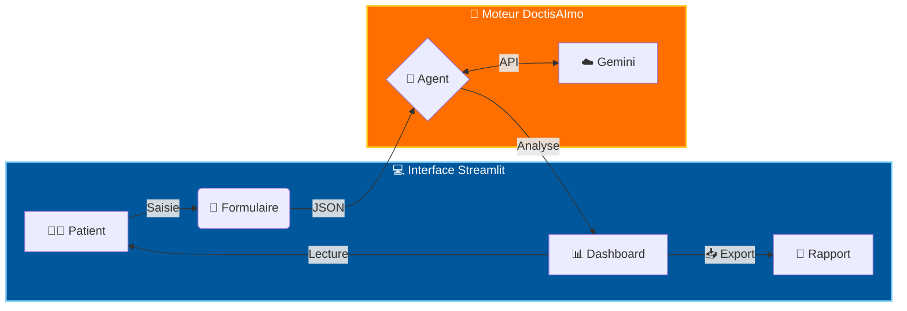
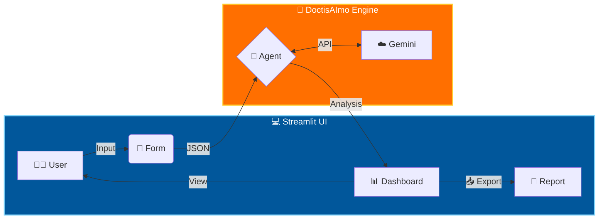

# 🏥 DoctisAImo (v4.0-DASHBOARD)

> **Assistant de Triage IA Avancé | Advanced AI Triage Assistant**


**Construit avec les outils et technologies :**


<div align="center">

[**🇫🇷 Français**](#-français) | [**🇬🇧 Anglais**](#-anglais) | [**🇪🇸 Espagnol**](#-espagnol) | [**🇮🇹 Italien**](#-italien) | [**🇵🇹 Portugais**](#-portugais) | [**🇷🇺 Russe**](#-russe) | [**🇩🇪 Allemand**](#-allemand) | [**🇹🇷 Turc**](#-turc)

</div>

---

<a name="-français"></a>

## 🇫🇷 Français

- [**Présentation**](#présentation)
- [**Démarrage**](#démarrage)
  - [Prérequis](#prérequis)
  - [Installation](#installation)
- [**Utilisation**](#utilisation)
- [**Tests**](#tests)

---

<a name="présentation"></a>

### 📝 Présentation

**DoctisAImo (v4.0-DASHBOARD)** est une plateforme de triage médical intelligent propulsée par l'IA. Elle transforme les protocoles d'urgence complexes en une interface web intuitive pour assister la prise de décision.

#### Fonctionnalités Clés (V4)

1. **🚑 Triage & Urgence** : Analyse des symptômes et classification automatique (Vert/Orange/Rouge) basée sur des logiques statistiques (Kaggle Datasets).
2. **🧠 Seconde Opinion** : Détection avancée de signaux faibles et "Red Flags".
3. **📋 Plan d'Action** : Génération instantanée de checklists d'intervention.
4. **💾 Export de Rapports** : Téléchargement des analyses au format JSON ou Texte (Nouvelle fonctionnalité).
5. **🖥️ Interface Pro** : Dashboard avec navigation latérale et visualisation des résultats en temps réel.

### 📐 Architecture & Workflow



<a name="démarrage"></a>

### 🚀 Démarrage

<a name="prérequis"></a>

#### 📋 Prérequis

- **Python 3.8+**
- **Clé API Gemini** (Google AI Studio)

<a name="installation"></a>

#### 💾 Installation

```bash
git clone https://github.com/Adam-Blf/Projet-IA-Generative-Doctis-AI-mo.git
cd Projet-IA-Generative-Doctis-AI-mo
pip install -r requirements.txt
```

<a name="utilisation"></a>

### 🎮 Utilisation

Lancez le tableau de bord web :

```bash
streamlit run app.py
```

**Navigation :**

- Utilisez la **Barre Latérale** pour basculer entre les modes (Triage, Seconde Opinion, etc.).
- Remplissez les données patient à **Gauche**.
- Visualisez l'analyse IA à **Droit**.
- **Téléchargez** le rapport via les boutons dédiés.

<a name="tests"></a>

### 🧪 Tests

Pour vérifier l'installation et lancer l'application en mode local :

```bash
streamlit run app.py
```

*(Le navigateur s'ouvrira automatiquement)*

---

<a name="-anglais"></a>

## 🇬🇧 Anglais

### Overview

**DoctisAImo** is a state-of-the-art AI assistant designed for emergency medical triage. Version 4.0 leverages **Data-Driven Logic** (inspired by Kaggle medical datasets) to interpret symptoms with statistical rigor. It provides safety assessments, second opinions, and emergency action plans.

### Features

1. **🏥 Intelligent Triage**: Data-driven analysis for Green, Orange, or Red codes.
2. **🧠 Second Opinion**: Detailed risk assessment and "Red Flag" identification.
3. **🛡️ Action Plan**: Immediate emergency checklist without jargon.
4. **🔗 Input Enrichment**: Structured keyword generation for vector search.

### 📐 Architecture & Workflow



### Installation

**Prerequisites**: Python 3.8+, Gemini API Key.

```bash
git clone https://github.com/Adam-Blf/Projet-IA-Generative-Doctis-AI-mo.git
cd Projet-IA-Generative-Doctis-AI-mo
pip install -r requirements.txt
```

### Verification

```bash
streamlit run app.py
```

---

<a name="-espagnol"></a>

## 🇪🇸 Espagnol

### Resumen

**DoctisAImo** es un asistente avanzado de IA para el triaje médico de emergencia. La versión 4.0 utiliza **Lógica Basada en Datos** (estilo Kaggle) para evaluar síntomas con rigor estadístico y proporcionar evaluaciones de seguridad.

### Funcionalidades

1. **🏥 Triaje Inteligente**: Análisis basado en datos para códigos Verde, Naranja o Rojo.
2. **🧠 Segunda Opinión**: Evaluación detallada de riesgos y detección de señales de alerta ("Red Flags").
3. **🛡️ Plan de Acción**: Lista de verificación de emergencia inmediata.
4. **🔗 Enriquecimiento de Entrada**: Generación de palabras clave para búsqueda vectorial.

### Instalación

**Requisitos**: Python 3.8+, Clave API Gemini.

```bash
git clone https://github.com/Adam-Blf/Projet-IA-Generative-Doctis-AI-mo.git
cd Projet-IA-Generative-Doctis-AI-mo
pip install -r requirements.txt
```

### Verificación

```bash
streamlit run app.py
```

---

<a name="-italien"></a>

## 🇮🇹 Italien

### Panoramica

**DoctisAImo** è un assistente IA all'avanguardia progettato per il triage medico di emergenza. La versione 4.0 sfrutta una **Logica Basata sui Dati** (ispirata ai dataset medici di Kaggle) per interpretare i sintomi con rigore statistico.

### Funzionalità

1. **🏥 Triage Intelligente**: Analisi basata sui dati per codici Verde, Arancione o Rosso.
2. **🧠 Seconda Opinione**: Valutazione dettagliata dei rischi e identificazione dei segnali di allarme ("Red Flags").
3. **🛡️ Piano d'Azione**: Checklist di emergenza immediata senza gergo medico.
4. **🔗 Arricchimento Input**: Generazione di parole chiave strutturate per la ricerca vettoriale.

### Installazione

**Prerequisiti**: Python 3.8+, Chiave API Gemini.

```bash
git clone https://github.com/Adam-Blf/Projet-IA-Generative-Doctis-AI-mo.git
cd Projet-IA-Generative-Doctis-AI-mo
pip install -r requirements.txt
```

### Verifica

```bash
streamlit run app.py
```

---

<a name="-portugais"></a>

## 🇵🇹 Portugais

### Visão Geral

**DoctisAImo** é um assistente de IA avançado projetado para triagem médica de emergência. A versão 4.0 aproveita a **Lógica Baseada em Dados** (inspirada em datasets médicos do Kaggle) para interpretar sintomas com rigor estatístico.

### Funcionalidades

1. **🏥 Triagem Inteligente**: Análise baseada em dados para códigos Verde, Laranja ou Vermelho.
2. **🧠 Segunda Opinião**: Avaliação detalhada de riscos e identificação de sinais de alerta ("Red Flags").
3. **🛡️ Plano de Ação**: Checklist de emergência imediata sem jargão médico.
4. **🔗 Enriquecimento de Entrada**: Geração de palavras-chave estruturada para busca vetorial.

### Instalação

**Pré-requisitos**: Python 3.8+, Chave API Gemini.

```bash
git clone https://github.com/Adam-Blf/Projet-IA-Generative-Doctis-AI-mo.git
cd Projet-IA-Generative-Doctis-AI-mo
pip install -r requirements.txt
```

### Verificação

```bash
streamlit run app.py
```

---

<a name="-russe"></a>

## 🇷🇺 Russe

### Обзор

**DoctisAImo** — это передовой ИИ-ассистент для экстренной медицинской сортировки (триажа). Версия 4.0 использует **логику, основанную на данных** (вдохновленную медицинскими датасетами Kaggle), для статистически точной интерпретации симптомов.

### Возможности

1. **🏥 Интеллектуальный триаж**: Анализ данных для присвоения Зеленого, Оранжевого или Красного кода.
2. **🧠 Второе мнение**: Детальная оценка рисков и выявление критических сигналов ("Red Flags").
3. **🛡️ План действий**: Чек-лист для экстренных ситуаций без сложной терминологии.
4. **🔗 Обогащение ввода**: Генерация структурированных ключевых слов для векторного поиска.

### Установка

**Требования**: Python 3.8+, Ключ API Gemini.

```bash
git clone https://github.com/Adam-Blf/Projet-IA-Generative-Doctis-AI-mo.git
cd Projet-IA-Generative-Doctis-AI-mo
pip install -r requirements.txt
```

### Проверка

```bash
streamlit run app.py
```

---

<a name="-allemand"></a>

## 🇩🇪 Allemand

### Überblick

**DoctisAImo** ist ein fortschrittlicher KI-Assistent für die medizinische Notfalltriage. Version 4.0 nutzt **datengetriebene Logik** (inspiriert von Kaggle-Datensätzen), um Symptome mit statistischer Genauigkeit zu interpretieren.

### Funktionen

1. **🏥 Intelligente Triage**: Datenbasierte Analyse für die Codes Grün, Orange oder Rot.
2. **🧠 Zweitmeinung**: Detaillierte Risikobewertung und Identifizierung von Warnsignalen ("Red Flags").
3. **🛡️ Aktionsplan**: Sofortige Notfall-Checkliste ohne Fachjargon.
4. **🔗 Eingabeanreicherung**: Generierung strukturierter Schlüsselwörter für die Vektorsuche.

### Installation

**Voraussetzungen**: Python 3.8+, Gemini API-Schlüssel.

```bash
git clone https://github.com/Adam-Blf/Projet-IA-Generative-Doctis-AI-mo.git
cd Projet-IA-Generative-Doctis-AI-mo
pip install -r requirements.txt
```

### Überprüfung

```bash
streamlit run app.py
```

---

<a name="-turc"></a>

## 🇹🇷 Turc

### Genel Bakış

**DoctisAImo**, acil tıbbi triyaj için tasarlanmış gelişmiş bir yapay zeka asistanıdır. Sürüm 4.0, semptomları istatistiksel titizlikle yorumlamak için **Veri Odaklı Mantık** (Kaggle veri setlerinden esinlenerek) kullanır.

### Özellikler

1. **🏥 Akıllı Triyaj**: Yeşil, Turuncu veya Kırmızı kodlar için veriye dayalı analiz.
2. **🧠 İkinci Görüş**: Ayrıntılı risk değerlendirmesi ve tehlike işaretlerinin ("Red Flags") tespiti.
3. **🛡️ Eylem Planı**: Tıbbi jargon içermeyen acil durum kontrol listesi.
4. **🔗 Girdi Zenginleştirme**: Vektör araması için yapılandırılmış anahtar kelime üretimi.

### Kurulum

**Gereksinimler**: Python 3.8+, Gemini API Anahtarı.

```bash
git clone https://github.com/Adam-Blf/Projet-IA-Generative-Doctis-AI-mo.git
cd Projet-IA-Generative-Doctis-AI-mo
pip install -r requirements.txt
```

### Doğrulama

```bash
streamlit run app.py
```

---

### ⚠️ Disclaimer / Avertissement

**DoctisAImo is an AI research project.** It is not a licensed medical professional. Always call emergency services (112/911) in life-threatening situations.

*DoctisAImo est un projet de recherche en IA. Ce n'est pas un professionnel de santé agréé. Appelez toujours les urgences en cas de danger vital.*
