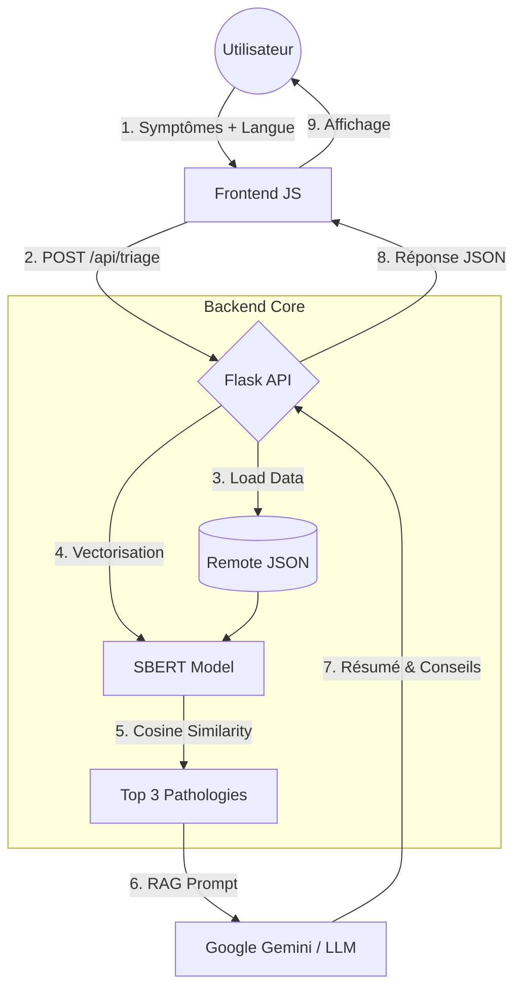

# Doctis-AI-mo


**Med-RAG MVP : Assistant de Triage Médical Multilingue (IA Générative + Analyse Sémantique).**

## 🧠 Architecture du Flux (AISCA)


## 🌍 Langues Supportées
🇫🇷 Français | 🇬🇧 Anglais | 🇪🇸 Espagnol | 🇮🇹 Italien | 🇵🇹 Portugais | 🇷🇺 Russe | 🇩🇪 Allemand | 🇹🇷 Turc

## 🚀 Fonctionnalités
*   **Triage Intelligent :** Analyse sémantique des symptômes via `sentence-transformers` (SBERT).
*   **Zero-Database :** Chargement des pathologies depuis une source distante (Remote Data Fetching).
*   **RAG (Retrieval Augmented Generation) :** Résumé et conseils générés par IA (Gemini/OpenAI).
*   **Interface Multilingue :** Client Web moderne "Medical Blue".

## 🛠️ Stack Technique
*   **Backend :** Python, Flask, Sentence-Transformers.
*   **Frontend :** HTML5, CSS3, Vanilla JS.

## 📦 Installation & Démarrage

1.  **Cloner le projet :**
    ```bash
    git clone https://github.com/Adam-Blf/Projet-IA-Generative-Doctis-AI-mo.git
    cd Projet-IA-Generative-Doctis-AI-mo
    ```

2.  **Installer les dépendances :**
    ```bash
    pip install -r requirements.txt
    ```

3.  **Lancer le serveur :**
    ```bash
    python app.py
    ```
    *(Le premier lancement téléchargera le modèle d'IA ~400Mo)*

4.  **Accéder à l'application :**
    Ouvrez `http://127.0.0.1:5000`
