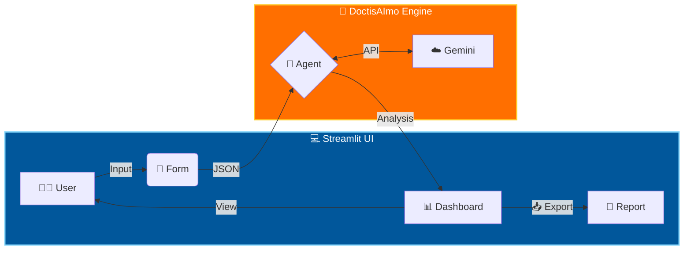

[](https://www.linkedin.com/in/adambeloucif/) [](https://doctis-aimo.onrender.com) 

  

## 📝 Description
Projet d'IA Générative pour Doctis.

## ⚡ Fonctionnalités
- IA Générative
- Traitement de données médicales/texte


### Construit avec les outils et technologies


🇫🇷 Français | 🇬🇧 Anglais | 🇪🇸 Espagnol | 🇮🇹 Italien | 🇵🇹 Portugais | 🇷🇺 Russe | 🇩🇪 Allemand | 🇹🇷 Turc

# 🏥 DoctisAImo (v15.4-Optimized)

> **Assistant de Triage IA Avancé | Advanced AI Triage Assistant**
>
> *Authors: Adam Beloucif & Amina Medjdoub*

**Construit avec les outils et technologies :**


<div align="center">

[**🇫🇷 Français**](#-français) | [**🇬🇧 Anglais**](#-anglais) | [**🇪🇸 Espagnol**](#-espagnol) | [**🇮🇹 Italien**](#-italien) | [**🇵🇹 Portugais**](#-portugais) | [**🇷🇺 Russe**](#-russe) | [**🇩🇪 Allemand**](#-allemand) | [**🇹🇷 Turc**](#-turc)

</div>

---

<a name="-français"></a>

## 🇫🇷 Français

- [**Présentation**](#présentation)
- [**Démarrage**](#démarrage)
  - [Prérequis](#prérequis)
  - [Installation](#installation)
- [**Utilisation**](#utilisation)
- [**Tests**](#tests)

---

<a name="présentation"></a>

### 📝 Présentation

**DoctisAImo v15.0 (Optimized)** est une solution de **Triage Médical Intelligent** de nouvelle génération.

Conçue pour assister les professionnels de santé et les services d'urgence, cette plateforme fusionne la puissance de l'**IA Générative** (Gemini 2.0) avec la rigueur de **données médicales vérifiées** (Dataset Kaggle) via une architecture RAG (Retrieval-Augmented Generation).

**Auteurs :** Adam Beloucif & Amina Medjdoub

#### Pourquoi DoctisAImo ?

- **Rapidité** : Triage instantané des patients (Code Vert/Orange/Rouge).

- **Précision** : Analyse croisée entre symptômes déclarés et statistiques cliniques réelles.
- **Sécurité** : Détection proactive des signaux faibles ("Red Flags") et protocoles d'urgence.

#### Fonctionnalités Principales (V15.0)

1. **🚑 Triage Automatisé** : Classification immédiate de l'urgence.
2. **🧠 Seconde Opinion IA** : Analyse différentielle pour réduire le risque d'erreur.
3. **📚 RAG avancé (5 sources)** : Fusion de datasets Kaggle (Symptômes, Précautions, Sévérité, etc.) pour des preuves factuelles.
4. **💾 Interface Premium** : Dashboard moderne avec onglets (Diagnostic, Soins, Sources).
5. **🛡️ Monitoring & DevOps** : Système "Keep-Alive" autonome et Pipeline CI/CD automatisé (Tests + Auto-Versioning).

### 📐 Architecture & Workflow (V15.0)

```mermaid
graph TD
    subgraph DevOps [⚙️ CI/CD Pipeline]
        GIT[Developer Push] -->|Trigger| ACT[🤖 GitHub Actions];
        ACT -->|1. Run Tests| TEST{🧪 Pytest};
        TEST -->|Pass| BUMP[🚀 Smart Auto-Bump];
        BUMP -->|Commit Tag| GIT;
    end

    subgraph Data [💾 Hub de Données]
        D1[dataset.csv] & D2[symptom_Description.csv] & D3[symptom_precaution.csv] --> ETL(⚙️ ETL Fusion);
        D4[Symptom-severity.csv] & D5[Symptom2Disease.csv] --> ETL;
        ETL --> KB[(📚 Base Optimisée)];
    end

    subgraph App [☁️ DoctisApp V15 (Render Cloud)]
        UI[🖥️ Premium UI] <-->|Chat & Tabs| A{🤖 Agent};
        A <-->|Raisonnement| G[☁️ Gemini 2.0];
        A <-->|RAG Query| KB;
        M[⏱️ Monitor] -.->|Ping| UI;
        M -.->|Logs| DB[(🍃 MongoDB)];
    end
    
    DevOps -.->|Deploy to Render| App
    
    style Data fill:#2e7d32,stroke:#4caf50,stroke-width:2px,color:#fff
    style App fill:#1565c0,stroke:#42a5f5,stroke-width:2px,color:#fff
    style DevOps fill:#6a1b9a,stroke:#8e24aa,stroke-width:2px,color:#fff
```

<a name="démarrage"></a>

### 🚀 Démarrage Rapide

Suivez ces étapes pour déployer l'assistant de triage sur votre poste local.

<a name="prérequis"></a>

#### 📋 Prérequis Techniques

- **Python 3.8** ou version supérieure.

- Une **Clé API Google Gemini** (gratuite via Google AI Studio).
- Un compte **Kaggle** (pour le téléchargement automatique des datasets).

<a name="installation"></a>

#### 💾 Installation

1. **Cloner le projet**

    ```bash
    git clone https://github.com/Adam-Blf/Projet-IA-Generative-Doctis-AI-mo.git
    cd Projet-IA-Generative-Doctis-AI-mo
    ```

2. **Installer les dépendances**

    ```bash
    pip install -r requirements.txt
    ```

3. **Configuration (Variables d'environnement)**
    Créez un fichier `.env` à la racine et ajoutez vos clés :

    ```ini
    GOOGLE_API_KEY="votre_clé_gemini_ici"
    KAGGLE_USERNAME="votre_user_kaggle"
    KAGGLE_KEY="votre_clé_kaggle"
    ```

<a name="utilisation"></a>

### 🎮 Utilisation

**Accès Direct (Live Demo) :**
👉 **[https://doctis-aimo.onrender.com](https://doctis-aimo.onrender.com)**

Ou lancez le tableau de bord web en local :contrôle via la commande suivante :

```bash
streamlit run app.py
```

L'application s'ouvrira automatiquement dans votre navigateur (**<http://localhost:8501>**).

**Guide de l'interface :**

- **Menu Latéral** : Naviguez entre "Urgence & Triage", "Seconde Opinion" et "À propos".
- **Formulaire** : Saisissez l'âge, le genre et les symptômes (ex: *"Douleur thoracique irradiant bras gauche"*).
- **Résultats** : Observez l'analyse en temps réel, les alertes de sécurité et les preuves issues du dataset.

<a name="tests"></a>

### 🧪 Tests & Vérification

Pour vérifier que l'environnement est correctement configuré (API connectées, librairies chargées) :

```bash
# Lancer le script de test unitaire de l'agent
python src/agent.py
```

*Si tout fonctionne, vous verrez : `✅ Agent Chargé : DoctisAImo v15.4-Optimized`.*

---

<a name="-anglais"></a>

## 🇬🇧 Anglais

### Overview

**DoctisAImo** is a state-of-the-art AI assistant designed for emergency medical triage. Version 5.0 leverages **Real-world Medical Data** (RAG via Kaggle) to interpret symptoms with statistical rigor. It provides safety assessments, second opinions, and emergency action plans.

### Features

1. **🏥 Intelligent Triage**: Data-driven analysis for Green, Orange, or Red codes.
2. **🧠 Second Opinion**: Detailed risk assessment and "Red Flag" identification.
3. **🛡️ Action Plan**: Immediate emergency checklist without jargon.
4. **🔗 Input Enrichment**: Structured keyword generation for vector search.

### 📐 Architecture & Workflow



### Installation

**Prerequisites**: Python 3.8+, Gemini API Key.

```bash
git clone https://github.com/Adam-Blf/Projet-IA-Generative-Doctis-AI-mo.git
cd Projet-IA-Generative-Doctis-AI-mo
pip install -r requirements.txt
```

### Verification

```bash
streamlit run app.py
```

---

<a name="-espagnol"></a>

## 🇪🇸 Espagnol

### Resumen

**DoctisAImo** es un asistente avanzado de IA para el triaje médico de emergencia. La versión 5.0 utiliza **Datos Médicos Reales** (RAG vía Kaggle) para evaluar síntomas con rigor estadístico y proporcionar evaluaciones de seguridad.

### Funcionalidades

1. **🏥 Triaje Inteligente**: Análisis basado en datos para códigos Verde, Naranja o Rojo.
2. **🧠 Segunda Opinión**: Evaluación detallada de riesgos y detección de señales de alerta ("Red Flags").
3. **🛡️ Plan de Acción**: Lista de verificación de emergencia inmediata.
4. **🔗 Enriquecimiento de Entrada**: Generación de palabras clave para búsqueda vectorial.

### Instalación

**Requisitos**: Python 3.8+, Clave API Gemini.

```bash
git clone https://github.com/Adam-Blf/Projet-IA-Generative-Doctis-AI-mo.git
cd Projet-IA-Generative-Doctis-AI-mo
pip install -r requirements.txt
```

### Verificación

```bash
streamlit run app.py
```

---

<a name="-italien"></a>

## 🇮🇹 Italien

### Panoramica

**DoctisAImo** è un assistente IA all'avanguardia progettato per il triage medico di emergenza. La versione 5.0 sfrutta **Dati Medici Reali** (RAG via Kaggle) per interpretare i sintomi con rigore statistico.

### Funzionalità

1. **🏥 Triage Intelligente**: Analisi basata sui dati per codici Verde, Arancione o Rosso.
2. **🧠 Seconda Opinione**: Valutazione dettagliata dei rischi e identificazione dei segnali di allarme ("Red Flags").
3. **🛡️ Piano d'Azione**: Checklist di emergenza immediata senza gergo medico.
4. **🔗 Arricchimento Input**: Generazione di parole chiave strutturate per la ricerca vettoriale.

### Installazione

**Prerequisiti**: Python 3.8+, Chiave API Gemini.

```bash
git clone https://github.com/Adam-Blf/Projet-IA-Generative-Doctis-AI-mo.git
cd Projet-IA-Generative-Doctis-AI-mo
pip install -r requirements.txt
```

### Verifica

```bash
streamlit run app.py
```

---

<a name="-portugais"></a>

## 🇵🇹 Portugais

### Visão Geral

**DoctisAImo** é um assistente de IA avançado projetado para triagem médica de emergência. A versão 5.0 aproveita **Dados Médicos Reais** (RAG via Kaggle) para interpretar sintomas com rigor estatístico.

### Funcionalidades

1. **🏥 Triagem Inteligente**: Análise baseada em dados para códigos Verde, Laranja ou Vermelho.
2. **🧠 Segunda Opinião**: Avaliação detalhada de riscos e identificação de sinais de alerta ("Red Flags").
3. **🛡️ Plano de Ação**: Checklist de emergência imediata sem jargão médico.
4. **🔗 Enriquecimento de Entrada**: Geração de palavras-chave estruturada para busca vetorial.

### Instalação

**Pré-requisitos**: Python 3.8+, Chave API Gemini.

```bash
git clone https://github.com/Adam-Blf/Projet-IA-Generative-Doctis-AI-mo.git
cd Projet-IA-Generative-Doctis-AI-mo
pip install -r requirements.txt
```

### Verificação

```bash
streamlit run app.py
```

---

<a name="-russe"></a>

## 🇷🇺 Russe

### Обзор

**DoctisAImo** — это передовой ИИ-ассистент для экстренной медицинской сортировки (триажа). Версия 5.0 использует **реальные медицинские данные** (RAG через Kaggle), для статистически точной интерпретации симптомов.

### Возможности

1. **🏥 Интеллектуальный триаж**: Анализ данных для присвоения Зеленого, Оранжевого или Красного кода.
2. **🧠 Второе мнение**: Детальная оценка рисков и выявление критических сигналов ("Red Flags").
3. **🛡️ План действий**: Чек-лист для экстренных ситуаций без сложной терминологии.
4. **🔗 Обогащение ввода**: Генерация структурированных ключевых слов для векторного поиска.

### Установка

**Требования**: Python 3.8+, Ключ API Gemini.

```bash
git clone https://github.com/Adam-Blf/Projet-IA-Generative-Doctis-AI-mo.git
cd Projet-IA-Generative-Doctis-AI-mo
pip install -r requirements.txt
```

### Проверка

```bash
streamlit run app.py
```

---

<a name="-allemand"></a>

## 🇩🇪 Allemand

### Überblick

**DoctisAImo** ist ein fortschrittlicher KI-Assistent für die medizinische Notfalltriage. Version 5.0 nutzt **echte medizinische Daten** (RAG via Kaggle), um Symptome mit statistischer Genauigkeit zu interpretieren.

### Funktionen

1. **🏥 Intelligente Triage**: Datenbasierte Analyse für die Codes Grün, Orange oder Rot.
2. **🧠 Zweitmeinung**: Detaillierte Risikobewertung und Identifizierung von Warnsignalen ("Red Flags").
3. **🛡️ Aktionsplan**: Sofortige Notfall-Checkliste ohne Fachjargon.
4. **🔗 Eingabeanreicherung**: Generierung strukturierter Schlüsselwörter für die Vektorsuche.

### Installation

**Voraussetzungen**: Python 3.8+, Gemini API-Schlüssel.

```bash
git clone https://github.com/Adam-Blf/Projet-IA-Generative-Doctis-AI-mo.git
cd Projet-IA-Generative-Doctis-AI-mo
pip install -r requirements.txt
```

### Überprüfung

```bash
streamlit run app.py
```

---

<a name="-turc"></a>

## 🇹🇷 Turc

### Genel Bakış

**DoctisAImo**, acil tıbbi triyaj için tasarlanmış gelişmiş bir yapay zeka asistanıdır. Sürüm 5.0, semptomları istatistiksel titizlikle yorumlamak için **Gerçek Tıbbi Veriler** (Kaggle aracılığıyla RAG) kullanır.

### Özellikler

1. **🏥 Akıllı Triyaj**: Yeşil, Turuncu veya Kırmızı kodlar için veriye dayalı analiz.
2. **🧠 İkinci Görüş**: Ayrıntılı risk değerlendirmesi ve tehlike işaretlerinin ("Red Flags") tespiti.
3. **🛡️ Eylem Planı**: Tıbbi jargon içermeyen acil durum kontrol listesi.
4. **🔗 Girdi Zenginleştirme**: Vektör araması için yapılandırılmış anahtar kelime üretimi.

### Kurulum

**Gereksinimler**: Python 3.8+, Gemini API Anahtarı.

```bash
git clone https://github.com/Adam-Blf/Projet-IA-Generative-Doctis-AI-mo.git
cd Projet-IA-Generative-Doctis-AI-mo
pip install -r requirements.txt
```

### Doğrulama

```bash
streamlit run app.py
```

---

### ⚠️ Disclaimer / Avertissement

**DoctisAImo is an AI research project.** It is not a licensed medical professional. Always call emergency services (112/911) in life-threatening situations.

*DoctisAImo est un projet de recherche en IA. Ce n'est pas un professionnel de santé agréé. Appelez toujours les urgences en cas de danger vital.*