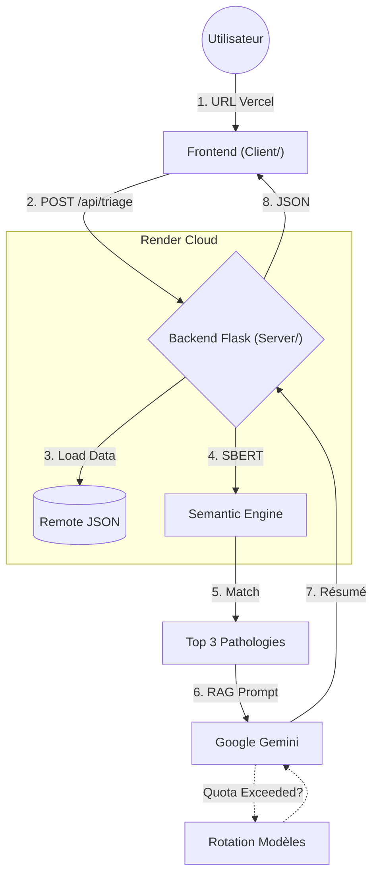

# Doctis-AI-mo (v1.0 Ready)


**Med-RAG MVP : Assistant de Triage Médical Multilingue (IA Générative + Analyse Sémantique).**

## 🧠 Architecture du Flux (Déployable)



## 🌍 Langues Supportées

🇫🇷 Français | 🇬🇧 Anglais | 🇪🇸 Espagnol | 🇮🇹 Italien | 🇵🇹 Portugais | 🇷🇺 Russe | 🇩🇪 Allemand | 🇹🇷 Turc

## 🚀 Installation & Développement Local

Le projet est divisé en deux parties :

### 1. Backend (API)

```bash
cd server
pip install -r requirements.txt
python app.py
# API running at http://127.0.0.1:5000
```

### 2. Frontend (Client)

Ouvrez simplement `client/index.html` dans votre navigateur.
*Note : Assurez-vous que `client/static/js/config.js` pointe bien vers `http://127.0.0.1:5000`.*

## ☁️ Déploiement

### Backend (Render)

1. Connectez le repo à **Render**.
2. Le fichier `render.yaml` à la racine configurera automatiquement le service Python dans le dossier `server/`.

### Frontend (Vercel)

1. Connectez le repo à **Vercel**.
2. Le fichier `vercel.json` à la racine configurera le déploiement statique du dossier `client/`.
3. **Une fois déployé :** Copiez l'URL de l'API Render et collez-la dans `client/static/js/config.js` avant de push la version finale.
